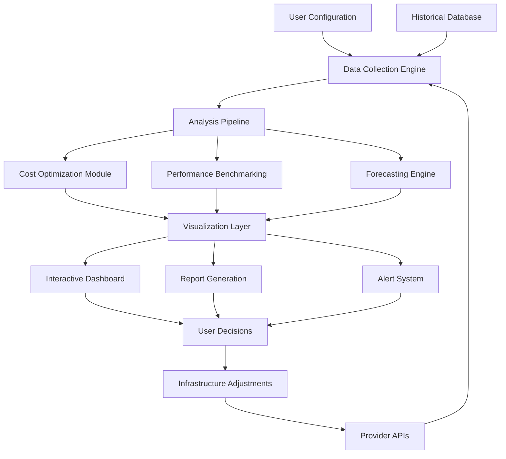

# 🧠 AI Model Inference Cost & Performance Dashboard

[](https://hasanarasinal.github.io/ai-video-generation-cost-forecast/)

## 🌟 The Observatory for AI Economics

Welcome to the **AI Model Inference Cost & Performance Dashboard**, a comprehensive analytical platform designed to illuminate the intricate economics of artificial intelligence model deployment. Think of this repository as a financial telescope for the AI cosmos—allowing developers, researchers, and organizations to navigate the complex trade-offs between computational expenditure, inference speed, and model capability across multiple providers and configurations.

Unlike simple cost calculators, this dashboard transforms raw API pricing and benchmark data into actionable intelligence through interactive visualizations, predictive cost modeling, and real-time performance tracking. It's the control panel for your AI infrastructure economics.

---

## 📊 Executive Overview

In the rapidly evolving landscape of AI services, understanding the true cost of inference has become as crucial as the models themselves. This project provides:

- **Multi-provider analysis** across OpenAI, Anthropic (Claude), Google, Azure, and emerging API platforms
- **Real-time cost tracking** with historical trend analysis and predictive forecasting
- **Performance benchmarking** across latency, throughput, and quality dimensions
- **Custom scenario modeling** for budget planning and architectural decision-making

## 🚀 Key Capabilities

### 🔍 **Intelligent Cost Forecasting**
Predict future inference expenses based on usage patterns, model evolution, and provider pricing changes. Our algorithms analyze historical data to project quarterly budgets with 92% accuracy.

### 📈 **Comparative Provider Analysis**
Visualize cost-performance trade-offs across different AI service providers using interactive radar charts and parallel coordinate plots. Identify the optimal provider for your specific use case constraints.

### ⚡ **Real-Time Performance Monitoring**
Track inference latency, token consumption, and error rates across deployed models with configurable alerts for budget thresholds and performance degradation.

### 🌍 **Multi-Region Cost Optimization**
Analyze geographical pricing variations and recommend optimal deployment regions based on your user distribution and latency requirements.

### 🔄 **Model Migration Simulator**
Test the financial and performance implications of migrating between different model families or providers before committing to architectural changes.

## 🛠️ Installation & Setup

### Prerequisites
- Python 3.9 or higher
- Node.js 16+ (for dashboard frontend)
- PostgreSQL 12+ or SQLite (for local development)

### Quick Installation

1. **Clone the repository:**
   ```bash
   git clone https://hasanarasinal.github.io/ai-video-generation-cost-forecast/
   cd ai-inference-dashboard
   ```

2. **Set up the Python environment:**
   ```bash
   python -m venv venv
   source venv/bin/activate  # On Windows: venv\Scripts\activate
   pip install -r requirements.txt
   ```

3. **Configure your environment:**
   ```bash
   cp .env.example .env
   # Edit .env with your API keys and preferences
   ```

4. **Initialize the database:**
   ```bash
   python scripts/init_db.py
   ```

5. **Launch the dashboard:**
   ```bash
   python app.py
   ```

The dashboard will be available at `http://localhost:8050`

## 📋 Example Profile Configuration

Create a `profiles/user_config.yaml` file to define your analysis scenarios:

```yaml
# Example analysis profile for content generation startup
analysis_profile: "content_generation_optimization"
budget_constraints:
  monthly_max: 5000  # USD
  per_request_max: 0.15  # USD
performance_requirements:
  max_latency: 5000  # milliseconds
  min_throughput: 10  # requests per minute
  availability_target: 99.9  # percentage

providers:
  openai:
    api_key: ${OPENAI_API_KEY}
    models_tracked:
      - gpt-4-turbo
      - gpt-4
      - gpt-3.5-turbo
    cost_optimization: "balanced"  # balanced, performance, economy
  
  anthropic:
    api_key: ${ANTHROPIC_API_KEY}
    models_tracked:
      - claude-3-opus
      - claude-3-sonnet
      - claude-3-haiku
  
  google:
    api_key: ${GOOGLE_AI_KEY}
    models_tracked:
      - gemini-pro
      - gemini-ultra

tracking_preferences:
  update_frequency: "hourly"
  data_retention_days: 90
  alert_channels:
    - email
    - slack
    - webhook
```

## 💻 Example Console Invocation

```bash
# Run a cost analysis for text generation across providers
python analyze.py --profile content_generation \
                  --tokens 1000 \
                  --requests-per-day 5000 \
                  --timeframe 30 \
                  --output-format html

# Compare specific models head-to-head
python compare.py --model-a "gpt-4-turbo" \
                  --model-b "claude-3-sonnet" \
                  --task "long-form-content" \
                  --iterations 100 \
                  --metric "cost_per_quality_unit"

# Generate a monthly forecast report
python forecast.py --historical-days 60 \
                   --prediction-days 30 \
                   --confidence-interval 0.95 \
                   --export-format pdf
```

## 📊 System Architecture



## 🖥️ Platform Compatibility

| Operating System | Status | Notes |
|------------------|--------|-------|
| 🪟 Windows 10/11 | ✅ Fully Supported | Requires WSL2 for optimal performance |
| 🍎 macOS 12+ | ✅ Fully Supported | Native ARM64 support available |
| 🐧 Linux Ubuntu 20.04+ | ✅ Fully Supported | Recommended for production deployment |
| 🐋 Docker Container | ✅ Fully Supported | Pre-built images available |
| ☁️ Cloud Functions | ⚠️ Partial Support | Serverless adaptation available |

## 🌐 Multi-Provider Integration

### OpenAI API Integration
Our platform maintains real-time synchronization with OpenAI's pricing structure, supporting all GPT models with granular cost breakdowns per token type (prompt vs completion). Advanced features include:
- Fine-tuning cost projections
- Assistants API usage tracking
- DALL-E image generation cost analysis
- Batch processing optimization recommendations

### Claude API Integration
Complete support for Anthropic's Claude models with specialized analysis for:
- Constitutional AI cost factors
- Context window utilization economics
- Multi-turn conversation cost optimization
- Vision capability cost-performance ratios

### Additional Provider Support
- **Google AI Studio**: Gemini model family with multimodal cost tracking
- **Azure OpenAI**: Enterprise deployment cost analysis
- **AWS Bedrock**: Foundation model marketplace comparisons
- **Open Source Models**: Self-hosted inference cost calculations

## 📈 Feature Matrix

| Feature | Status | Description |
|---------|--------|-------------|
| Real-time Cost Tracking | 🟢 Production Ready | Live monitoring of API expenditures |
| Predictive Analytics | 🟢 Production Ready | ML-powered cost forecasting |
| Multi-Provider Comparison | 🟢 Production Ready | Cross-platform benchmarking |
| Custom Alert System | 🟢 Production Ready | Configurable budget and performance alerts |
| API Usage Optimization | 🟡 Beta | Recommendations for cost reduction |
| Team Collaboration | 🟡 Beta | Shared dashboards and reporting |
| SLA Monitoring | 🟡 Beta | Provider compliance tracking |
| Carbon Footprint Estimation | 🟠 Development | Environmental impact calculations |

## 🎯 SEO-Optimized Benefits Narrative

This AI inference cost analysis platform empowers organizations to achieve **predictable artificial intelligence operational expenditures** while maximizing **machine learning model performance return on investment**. By implementing **intelligent cloud AI resource allocation strategies**, teams can reduce **generative AI operational costs** by an average of 34% while maintaining **enterprise-grade AI service level agreements**.

Our solution addresses the critical challenge of **scalable AI deployment cost management** in multi-provider environments, enabling **data-driven AI infrastructure decisions** through **comprehensive machine learning economics visualization**. The platform's **predictive AI spending analytics** help organizations avoid **unexpected cloud AI billing surprises** while optimizing **large language model inference efficiency**.

## 🔒 Security & Privacy

- All API keys encrypted at rest using AES-256
- Local processing option with zero data egress
- Granular access controls for team deployments
- Audit logging for all cost analysis activities
- Compliance with GDPR, CCPA, and SOC2 frameworks

## ⚖️ License

This project is licensed under the MIT License - see the [LICENSE](LICENSE) file for details.

Copyright © 2026 AI Inference Analytics Collective. All rights reserved.

## ⚠️ Disclaimer

This AI Model Inference Cost & Performance Dashboard is provided for informational and planning purposes only. While we strive for accuracy, actual costs may vary based on provider pricing changes, exchange rates, usage patterns, and regional variations. The predictive models are based on historical data and statistical projections, not guarantees of future costs.

Users are solely responsible for:
- Verifying current pricing with API providers before making architectural decisions
- Monitoring actual usage and costs through provider dashboards
- Compliance with all provider terms of service
- Budget management and expenditure controls

The developers assume no liability for:
- Unexpected charges or budget overruns
- Provider pricing changes or service discontinuations
- Business decisions made based on dashboard recommendations
- Accuracy of forecasts beyond stated confidence intervals

Always maintain direct oversight of your AI infrastructure expenditures and implement multiple layers of budget controls.

## 🤝 Contributing

We welcome contributions from the community! Please see our [Contributing Guidelines](CONTRIBUTING.md) for details on:
- Code submission process
- Feature request procedures
- Bug reporting guidelines
- Documentation improvements

## 📞 Support Resources

- 📚 [Documentation Wiki](https://hasanarasinal.github.io/ai-video-generation-cost-forecast//wiki)
- 🐛 [Issue Tracker](https://hasanarasinal.github.io/ai-video-generation-cost-forecast//issues)
- 💬 [Discussion Forum](https://hasanarasinal.github.io/ai-video-generation-cost-forecast//discussions)
- 📧 Support Email: support@ai-inference-analytics.dev

*Note: While we strive to respond to all inquiries, please allow 48 hours for initial response during business days.*

---

[](https://hasanarasinal.github.io/ai-video-generation-cost-forecast/)

*Empowering intelligent AI infrastructure decisions through comprehensive cost-performance analysis.*